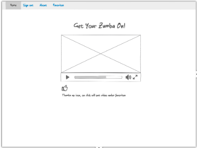

##Let's Zumba with React Router and Firebase

Let's Zumba is build with React components and Firebase database. User's can
rate zumba videos and save their favorites.

   

##Overview

Our app let's the user view zumba exercise videos pulled from the youTube API.
Users can view different videos and rate them from one to five stars.  Videos that
are rated four stars and above get saved in the Favorites page.

##Use Case

Zumba is a worldwide phenomenon, there are almost double the amount of Zumba
classes available than there are gyms in the world. And that's because people can
do Zumba classes in schools, churches, outdoors - anywhere with a good sound
system. With our Zumba app we can take that even further by bringing Zumba right
into the user's home. They can use our app to scroll through many different
Zumba videos and save their favorites.

What better way to get a great and fun workout without having to go to the gym?
Stay at home parents can do Zumba while their babies are napping, shy people can
do a dance off alone in their living room. It appeals to people young and old,
our app can be useful to anyone who just wants a simple and fun exercise in the
privacy of their own home.

##UX

The initial wireframes can be seen below:

   

This app has been designed to be simple enough to be used by anyone easily. The
users log in and land on the home page. This page shows the first youTube Zumba
video pulled from the API. The users can rate the video from one to five stars.
For the next video the users click on the next button, to go back they click the
previous button.

The videos that are rated four stars and above get saved into the user's Favorites
page. Here they have the choice to delete the video in their queue. When the
user logs out and logs back in, they can go directly to their Favorites page,
where all the videos they rated four stars and above are saved. Or they can go
to the home page and scroll through more videos and rate them.

##Working Prototype

For a working demo of the app go [here](https://tranquil-ravine-98658.herokuapp.com/).

##Technical

###Tech Stack

* React
* Firebase
* ES6
* Babel
* Webpack
* Travis CI
* Heroku

With our [Zumba App](https://tranquil-ravine-98658.herokuapp.com/) user
authentication, register and login/logout functionality is done through Firebase.
[Firebase](https://firebase.google.com/) is a mobile and web application platform
provided by Google. One of it's best features is a realtime database, which allows
developers to store and sync data across multiple clients.

The Zumba App is build and written in ES6 and React.  We pull data from the YouTube
API, store the necessary data in Firebase and build the different parts of the app
with React components.  State is synced with our Firebase database, so whenever the
user makes a change in the app or the database, state is synced from both ends.
Continuous deployment is done through Travis CI and Heroku.

This project was bootstrapped with [Auth with React Router V4 and Firebase V3](https://github.com/tylermcginnis/react-router-firebase-auth).
